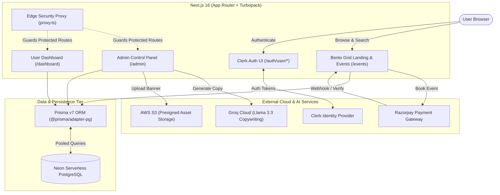

<div align="center">

# 🎫 EventFlow
### Next-Gen Serverless Event Booking & Management Platform

[-black?style=for-the-badge&logo=next.js)](https://nextjs.org/)
[](https://react.dev/)
[](https://www.typescriptlang.org/)
[](https://www.prisma.io/)
[](https://neon.tech/)
[](https://clerk.com/)
[](https://tailwindcss.com/)
[](https://razorpay.com/)
[](https://groq.com/)

<p align="center">
  A production-grade, AI-accelerated event ticketing and operations ecosystem featuring high-concurrency booking, real-time analytics, instant digital QR passes, and automated promotional copywriting.
</p>

[Explore Features](#-key-features) •
[System Architecture](#-system-architecture) •
[Getting Started](#-getting-started) •
[Environment Configuration](#-environment-variables) •
[API & Workflows](#-api-routes--architecture)

</div>

---

## 🌟 Key Features

### 🎨 1. Editorial Neo-Brutalist Design System
- Custom theme built with **TailwindCSS v4**, featuring an ultra-crisp palette (Charcoal, Warm Yellow `#ffe17c`, and Sage).
- Expressive typography combining **Anton** display titles with clean **Satoshi** body type.
- Smooth inertial scrolling powered by **Lenis** and physics-based fluid spring micro-interactions with **Framer Motion**.
- Full Dark / Light mode support with ambient reactive glowing backgrounds.

### 🔐 2. Enterprise Authentication & Role Security
- Multi-provider authentication managed through **Clerk**, customized with custom theme tokens.
- Optimized custom login (`/auth/user/login`) and registration (`/auth/user/register`) interfaces with instant social auth (Google, GitHub, Apple) and email magic links.
- Edge proxy routing ([src/proxy.ts](file:///d:/PROJECT/eventflow2/src/proxy.ts)) protecting administrative and dashboard paths with Role-Based Access Control (RBAC).

### 🤖 3. Groq-Powered AI Event Copywriter
- Integrated with **Groq Cloud API** running ultra-low latency **Llama 3.3** inference.
- Event organizers can generate high-converting, punchy promotional descriptions, agenda bullet points, and social teasers with a single click.

### ⚡ 4. High-Performance Serverless Database Layer
- **Neon Serverless PostgreSQL** database backed by `@prisma/adapter-pg` connection pooling for non-blocking edge execution.
- Transactional seat capacity reservation preventing overselling or double-booking during peak traffic.
- Full administrative audit logging (`AdminLog`) capturing operational actions and timestamps.

### 💳 5. Seamless Razorpay Payments & QR Verification
- Integrated with the **Razorpay Orders API** with HMAC-SHA256 signature verification.
- Instant digital ticket generation with cryptographic booking tokens.
- Dynamic SVG **QR Code passes** rendered for mobile check-in verification at event doors.

### ☁️ 6. Zero-Bottleneck S3 Media Pipeline
- Direct browser-to-cloud uploads using **AWS S3 Presigned URLs**.
- Bypasses server memory limits and functions payload caps for lightning-fast high-res banner uploads.

---

## 🏗 System Architecture



---

## 📂 Project Structure

```
eventflow2/
├── prisma/
│   ├── schema.prisma            # Database schema models (User, Event, Booking, Ticket, AdminLog)
│   └── migrations/              # PostgreSQL migration history
├── public/                      # Static brand assets and SVGs
├── scripts/
│   └── seed-admin.ts            # Admin seeding automation script
├── src/
│   ├── app/
│   │   ├── (public)/            # Public routes: Bento Grid hero, /events, /events/[id], /about
│   │   ├── admin/               # Admin panel: Metrics, event manager, audit logs
│   │   ├── api/                 # Serverless endpoints (webhooks, S3 presigned URLs, AI copy)
│   │   ├── auth/                # Optimized Clerk login & registration routes
│   │   ├── dashboard/           # User ticket repository & QR pass viewer
│   │   ├── globals.css          # Design system, CSS variables, Anton & Satoshi webfonts
│   │   ├── layout.tsx           # Global RootLayout with ClerkProvider, ThemeProvider, Toaster
│   │   └── template.tsx         # Route transition animations
│   ├── components/              # UI Component Library (Navbar, BentoGrid, AmbientBackground, etc.)
│   ├── lib/                     # Singletons (prisma.ts, s3.ts, groq.ts, razorpay.ts)
│   └── proxy.ts                 # Next.js edge security proxy & route protection
├── .env.example                 # Comprehensive environment variable template
├── next.config.ts               # Next.js configuration
├── package.json                 # Dependency manifest
└── tsconfig.json                # TypeScript compiler configuration
```

---

## 🚀 Getting Started

### Prerequisites

Ensure you have the following installed:
- **Node.js**: `v20.0.0` or higher
- **npm** or **pnpm**
- A **Neon Postgres** database instance
- Free accounts on **Clerk**, **Groq Cloud**, **Razorpay**, and an **AWS S3** bucket

---

### Step-by-Step Installation

#### 1. Clone the Repository
```bash
git clone https://github.com/Harshal844600/EVENTFLOW.git
cd EVENTFLOW
```

#### 2. Install Dependencies
```bash
npm install
```

#### 3. Setup Environment Variables
Duplicate `.env.example` into a new `.env` file:
```bash
cp .env.example .env
```
Open `.env` and fill in your actual credentials.

#### 4. Initialize Database & Seed Admin
```bash
# Push schema to database
npx prisma db push

# Generate Prisma Client
npx prisma generate

# Seed initial admin privileges
npm run seed
```

#### 5. Launch Development Server
```bash
npm run dev
```
Open [http://localhost:3000](http://localhost:3000) in your browser.

---

## 🔑 Environment Variables

| Variable | Description | Source |
| :--- | :--- | :--- |
| `DATABASE_URL` | Neon Serverless PostgreSQL connection string | [Neon Console](https://console.neon.tech/) |
| `NEXT_PUBLIC_CLERK_PUBLISHABLE_KEY` | Clerk Publishable API Key | [Clerk Dashboard](https://dashboard.clerk.com/) |
| `CLERK_SECRET_KEY` | Clerk Secret API Key | [Clerk Dashboard](https://dashboard.clerk.com/) |
| `NEXT_PUBLIC_CLERK_SIGN_IN_URL` | Default Sign In Path (`/auth/user/login`) | Local Route |
| `NEXT_PUBLIC_CLERK_SIGN_UP_URL` | Default Sign Up Path (`/auth/user/register`) | Local Route |
| `NEXT_PUBLIC_RAZORPAY_KEY_ID` | Razorpay Key ID (Test or Live) | [Razorpay Dashboard](https://dashboard.razorpay.com/) |
| `RAZORPAY_KEY_SECRET` | Razorpay Secret Key | [Razorpay Dashboard](https://dashboard.razorpay.com/) |
| `RAZORPAY_WEBHOOK_SECRET` | Razorpay Webhook Signing Secret | [Razorpay Dashboard](https://dashboard.razorpay.com/) |
| `AWS_ACCESS_KEY_ID` | AWS IAM User Key ID with S3 PutObject permission | [AWS IAM Console](https://console.aws.amazon.com/) |
| `AWS_SECRET_ACCESS_KEY` | AWS IAM Secret Access Key | [AWS IAM Console](https://console.aws.amazon.com/) |
| `AWS_REGION` | AWS Region where S3 bucket resides (e.g., `us-east-1`) | AWS Console |
| `S3_BUCKET_NAME` | Name of your AWS S3 bucket for event banners | AWS S3 Console |
| `GROQ_API_KEY` | Groq Cloud API key for Llama 3.3 copywriting | [Groq Console](https://console.groq.com/) |

---

## 🛠 Available Scripts

| Command | Action |
| :--- | :--- |
| `npm run dev` | Starts Next.js development server with Turbopack on `localhost:3000` |
| `npm run build` | Builds optimized production bundle |
| `npm run start` | Starts Next.js production server |
| `npm run lint` | Runs ESLint analysis across the project |
| `npm run seed` | Seeds administrative credentials using `scripts/seed-admin.ts` |
| `npx prisma studio` | Opens interactive web GUI to inspect Neon database tables |

---

## 🛡 Security & Best Practices

- **Zero Secret Leakage:** All sensitive credentials, tokens, and webhook secrets are kept strictly server-side and excluded via [.gitignore](file:///.gitignore).
- **Direct S3 Uploads:** Files are never routed through Next.js server memory, preventing memory starvation and Denial-of-Service.
- **Payment Verification:** Every payment requires cryptographic HMAC verification against the payment order ID before tickets are minted.
- **Type Safety:** Full end-to-end type safety from Prisma database models to React 19 UI components.

---

## 👨‍💻 Author

**Harshal Vidhate**
- GitHub: [@Harshal844600](https://github.com/Harshal844600)
- Repository: [EVENTFLOW](https://github.com/Harshal844600/EVENTFLOW)

---

## 📄 License

This project is licensed under the [MIT License](LICENSE).
